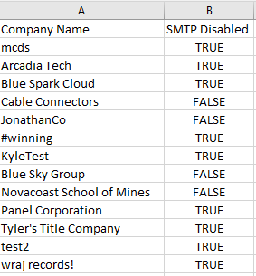

# Basic-Authentication-Reporting

The following project was created to help support MSPs in reporting basic authentication across customers under management.

Microsoft recently made some updates surrounding their plans to turn off basic auth in all tenants. The following article describes the recent updates:
<a href="https://techcommunity.microsoft.com/t5/exchange-team-blog/basic-authentication-and-exchange-online-september-2021-update/ba-p/2772210">Basic Authentication and Exchange Online – September 2021 Update - Microsoft Tech Community</a>

Highlights:
• Scope includes Exchange Web Services (EWS), Exchange ActiveSync (EAS), POP, IMAP, Remote PowerShell, MAPI, RPC, SMTP AUTH and OAB.
• Effective October 1, 2022, Microsoft will begin to permanently disable Basic Auth in all tenants, regardless of usage (with the exception of SMTP Auth, which can still be re-enabled after that).
• **MOST CONCERNING** Beginning early 2022, Microsoft will selectively pick tenants and disable Basic Auth for all affected protocols except SMTP AUTH for a period of 12-48 hours.
o You can request that specific protocols not be turned off on a per tenant basis (instructions in article above)

I wanted to provide some multi-tenant scripts to help in reporting on basic auth being used to prepare accordingly.

<H2>Author</H2>
Nick Ross

<H2>Prerequisites</H2>

You will need to garner tokens and GUIDs from both the Secure Application Model. The secure application model allows for a headless connection into all of your customer environments. The script to run that can be found from Kelvin over at CyberDrain. <a href="https://github.com/KelvinTegelaar/SecureAppModel/blob/master/Create-SecureAppModel.ps1">Click here to go to that page in Github.</a>

<H2>Functionality</H2>

The project is composed of 3 Powershell Scripts:
• Audit_Log_Activity.ps1 => Leverages Azure AD signin logs to present you will all basic auth sign-ins present within a 30 day window (Requires customers have Azure AD P1 license)
• Get_basicAuth_settings.ps1 => Leverages Exchange Online Powershell to look for tenant-wide basic auth setttings
• SMTP_auth_disabled.ps1 => Leverages Exchange Online Powershell to look for tenant-wide setting for SMTP auth.

<H3>Audit_Log_Activity.ps1</H3>

Ensure your app registration has the following permission> Microsoft Graph => Auditlog.Read.All (Delegated)

This script looks for basic auth sign-ins for each customer and presents them to you on the screen

A CSV is generated which list all basic auth sign ins present across all customers.

<H3>Get_basicAuth_settings.ps1</H3>

This script grabs all authentication settings within a tenant. In the UI, many of these settings can be seeing from Settings>Org Settings>Modern Authentication

One downside here is that if you have never modified these settings within the tenant, they will not return with the PowerShell cmdlets provided. For this reason, you may not have much success with this script.

<H3>SMTP_auth_disabled.ps1</H3>

SMTP auth is usually more popular because of things like copiers and printers that a company may be using. SMTP auth can be enabled or disabled at both a tenant level and at a user level. Its possible to have SMTP auth turned off at a tenant level but have it enabled at a user level. This script is just looking to see if SMTP auth is enabled at a tenant level for each company and reporting on that in a CSV.

